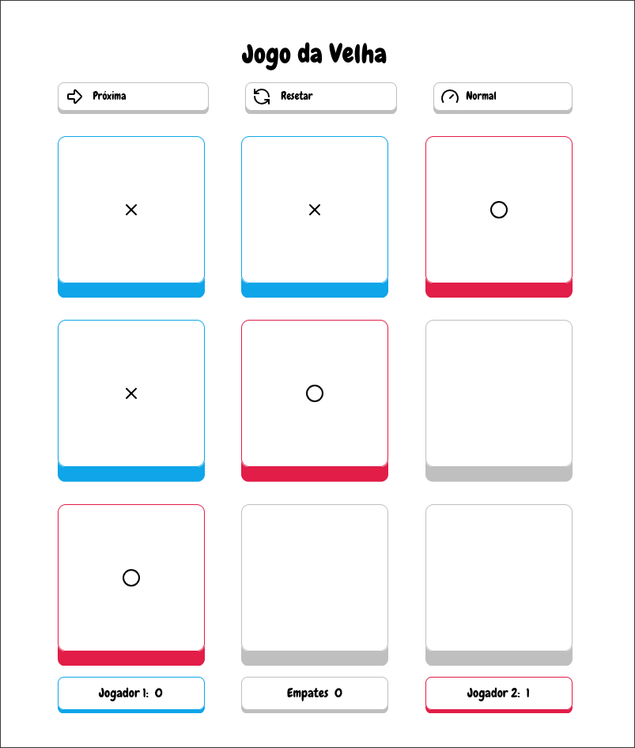
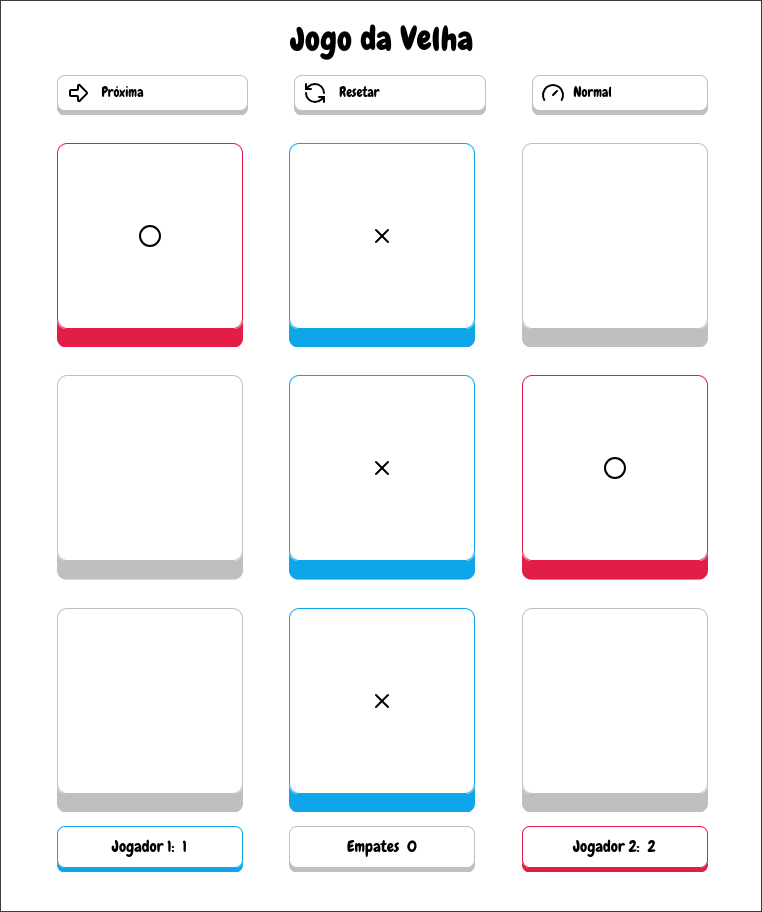

<!-- Badges: https://github.com/Ileriayo/markdown-badges -->

[HTML_BADGE]: https://img.shields.io/badge/html-%23E34F26.svg?style=for-the-badge&logo=html5&logoColor=white
[CSS_BADGE]: https://img.shields.io/badge/css-%231572B6.svg?style=for-the-badge&logo=css&logoColor=white
[JAVASCRIPT_BADGE]: https://img.shields.io/badge/javascript-%23323330.svg?style=for-the-badge&logo=javascript&logoColor=%23F7DF1E
[VITE_BADGE]: https://img.shields.io/badge/vite-%23646CFF.svg?style=for-the-badge&logo=vite&logoColor=white
[LUCIDE_BADGE]: https://img.shields.io/badge/lucide-F56565.svg?style=for-the-badge

<!-- Official websites of the technologies used -->

[VITE_SITE]: https://vite.dev/
[LUCIDE_SITE]: https://lucide.dev/

# ⭕ Jogo da Velha ❌

![HTML][HTML_BADGE]
![CSS][CSS_BADGE]
![JavaScript][JAVASCRIPT_BADGE]
[![Vite][VITE_BADGE]][VITE_SITE]
[![Lucide][LUCIDE_BADGE]][LUCIDE_SITE]

Um simples jogo da velha onde o usuário joga contra o computador com uma dificuldade específica.

Créditos ao professor Leornado Leitão (Cod3r), foi a partir de um projeto proposto por ele que decidi reecriá-lo adaptando-o para utilizar apenas tecnologias web vanilla.

## Demonstração

